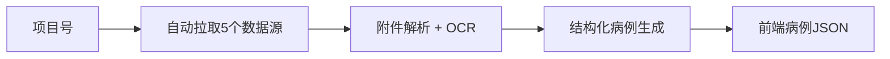

# 病例生成项目阶段汇报（面向管理层/非技术同事）

## 1. 项目要解决什么问题
- 目前 LIMS 每个项目有 5 个来源信息（3 段人工文本 + 2 个附件）。
- 附件格式复杂（Word/PDF/图片/压缩包），人工整理病例耗时且不稳定。
- 本项目目标：把这 5 个来源自动整合为一份可读、可追溯的病例 JSON，回传给系统使用。

## 2. 当前阶段成果（已完成）
- 已实现“一键输入项目号、自动输出病例结果”。
- 输出分两层：
  - 内部结构化病例（用于追溯和审核）
  - 前端展示病例（给业务同事阅读）
- 已支持附件自动下载、解压、OCR、信息整合、病例生成全流程。
- 已加入“噪声防护”：
  - 模板未勾选项不当作患者信息
  - 检测套餐/项目类信息不误写入临床病例

## 3. 业务使用方式（当前）
- 输入：项目号（`projectNumber`）
- 输出：
  - `frontend.json`（用于页面展示）
  - 包含 `summary`（摘要）和 `narrative`（完整病例段落）

## 4. 当前价值
- 明显降低手工整理成本。
- 输出内容可追溯（每条结论都有原文证据）。
- 形成统一接口，方便 IT 同事集成到现有 LIMS 页面。

## 5. 当前边界与风险
- 开发集暂时没有“标准答案”，本阶段以“工程可用、流程打通”为主，不以最终精度结论为目标。
- 个别样本仍会出现信息不足（状态 `partial/failed`），需要下一阶段提升召回。
- 模型与 OCR 质量会影响最终文本质量，需持续优化。

## 6. 状态口径（对业务）
- `ok`：已有较完整临床信息且质量告警为空。
- `partial`：有部分可用信息，但不够完整（例如只有检查结果）。
- `failed`：未提取到可用医学信息，需要人工复核或重跑。

## 7. 下一阶段计划（建议）
1. 建立小规模标注样本（gold set），形成可量化的效果评估。
2. 提升关键字段召回（主诉、病史、诊断）。
3. 做批量运行与日报表（成功率、partial/failed 原因）。
4. 容器化服务交付，便于部署到生产环境。
5. 预留 OCR 替换能力（未来可切本地开源 OCR 服务）。

## 8. 管理层可关注的里程碑
- 里程碑1：工程稳定（已达成）  
  一键输入项目号，稳定生成前端病例 JSON。
- 里程碑2：质量可量化（下一步）  
  有标注集、有评估指标、有持续改进节奏。
- 里程碑3：生产可部署（下一步）  
  容器服务化 + 对接现有 LIMS 页面。

