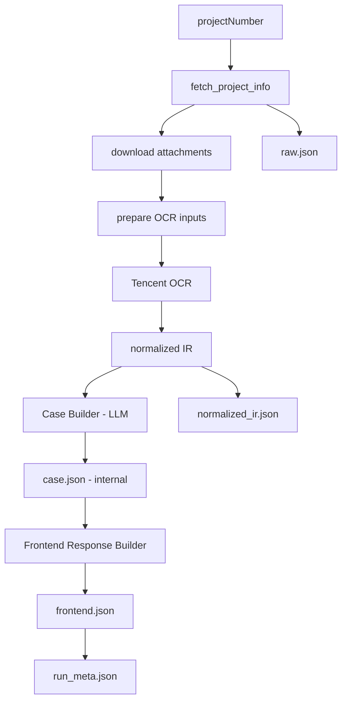

# 病例生成项目技术汇报（面向技术同事）

## 1. 项目背景与目标
- 背景：LIMS 系统中单个项目包含 5 个信息源（3 个文本字段 + 2 个附件字段），附件格式不统一且噪声高。
- 目标：输入 `projectNumber`，输出可追溯的结构化病例 JSON（内部）与前端消费 JSON（外部）。
- 原则：先保证“可追溯与稳定”，再持续优化召回率与可读性。

## 2. 当前已落地能力
- 一键流水线命令：`ykcg project-run <PROJECT_ID> --output-dir runs --mode llm`
- 端到端链路打通：
  1. 拉取 LIMS 数据与附件
  2. 附件预处理（docx/pdf/image -> OCR 输入图）
  3. OCR（腾讯 GeneralAccurateOCR）
  4. OCR + LIMS 组装 normalized IR
  5. LLM 两阶段生成内部病例 `case.json`
  6. 生成前端响应 `frontend.json`（含 `summary/narrative`）
- 运行元数据：`run_meta.json`（每步状态、耗时、错误）

## 3. 技术架构

## 4. 关键模块与职责
- `services/pipeline_runner.py`：一键编排器，串联全流程，输出 `run_meta`。
- `services/attachment_processing.py`：附件标准化，统一输出 OCR 输入图。
- `services/ocr_runner.py` + `services/ocr_clients/tencent.py`：OCR 调用与重试。
- `services/ir_builder.py`：LIMS + OCR 融合，产出统一 `DocumentIR`，并做模板/勾选框/boilerplate 标记。
- `services/candidate_fact_builder.py`：高信号候选事实构建（含噪声过滤、锚点邻域策略）。
- `services/case_builder.py`：LLM 两阶段病例生成 + schema 校验 + 保护规则。
- `services/case_response_builder.py`：前端 DTO 转换，生成 `status/summary/narrative`。

## 5. 数据契约
- 内部病例：`src/yk_case_generation/schemas/case_schema_v1.json`
- 前端响应：`src/yk_case_generation/schemas/case_response_v1.json`
  - 关键字段：`status`, `summary`, `narrative`, `sections`, `quality`

## 6. 质量与保护策略
- 未勾选模板项不作为患者事实（含 OCR 将方框识别成 `口/日/曰/□` 的场景）。
- 检测项目/套餐噪声过滤：避免污染临床字段。
- `tests_and_exams` 仅保留结果导向信息。
- `status` 判定规则：
  - `ok`：有核心临床信息且无质量警告
  - `partial`：有医学信息但不满足 `ok`（含仅检查结果）
  - `failed`：无可用医学信息

## 7. 运行与交付
- 环境配置：
  - `.env`（参考 `.env.example`）
  - 系统环境变量优先级高于 `.env`
- 关键变量：
  - OCR：`TENCENT_SECRET_ID`, `TENCENT_SECRET_KEY`
  - LLM：`LLM_ENDPOINT`, `LLM_API_KEY`, `LLM_MODEL`, `LLM_MODE`

## 8. 已知问题
- 开发集无 gold 标注，当前无法做严格性能指标（Precision/Recall/F1）。
- 个别样本召回仍偏低（尤其主诉/诊断）。
- narrative 可读性已提升，但仍有规则优化空间（句子排序与去模板化）。

## 9. 下一阶段技术路线
1. 建立小规模 gold set + 自动评估脚本（覆盖率、空样本、噪声泄漏）。
2. 增强 LIMS 兜底提取与 OCR 锚点召回策略。
3. 批量 `project-run`（CSV）官方命令与汇总报表。
4. 容器服务化（FastAPI 包装）与异步任务化。
5. OCR provider 插件化（`tencent/local`），支持本地开源 OCR 路线。

## 10. 参考文档
- 详细实现：`docs/IMPLEMENTATION_DETAILED.md`
- 流程总览：`docs/PIPELINE_OVERVIEW.md`
